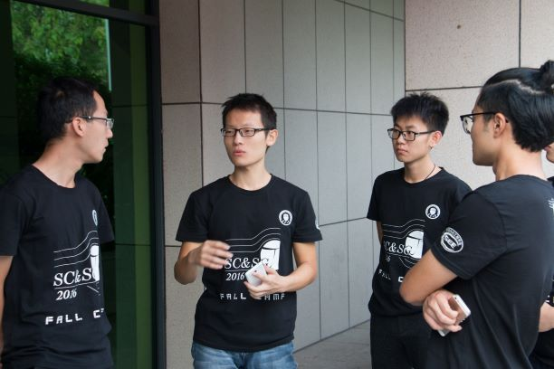

> Thanks for the guidance of Pro. Xin Ying and financial support of *Chinese Society for Electrical Engineering*. 
# Background
We organized a visiting activity for all students who registered for the camp. They visited the exhibition hall, where the superconductor equipments were displayed. As a leader, I was in charge of organizing this activity and giving them the first lecture that elaborated the Meissner Effect. 
# Equipment Display
## Magnet suspension 

## Oberving Meissner Effect through Measuring Force

## Mobius strip 

No beginning, no ending. 

## Roller Coaster

Reach the same height as beginning, almost.  

## Maglev vehicle

Really expensive. We picked several lucky students to have a try, it fell out and broke. Luckily, we had a back-up car.

# Live pictures
## Liquid Nitrogen

We really had great fun of this amazing liquid. It's a 'wow' moment when you pour it on your hand, and find no damage at all. 

## Having a discussion
  
We were actually discussing what we would eat for lunch...

## Presenting an Introduction
 

