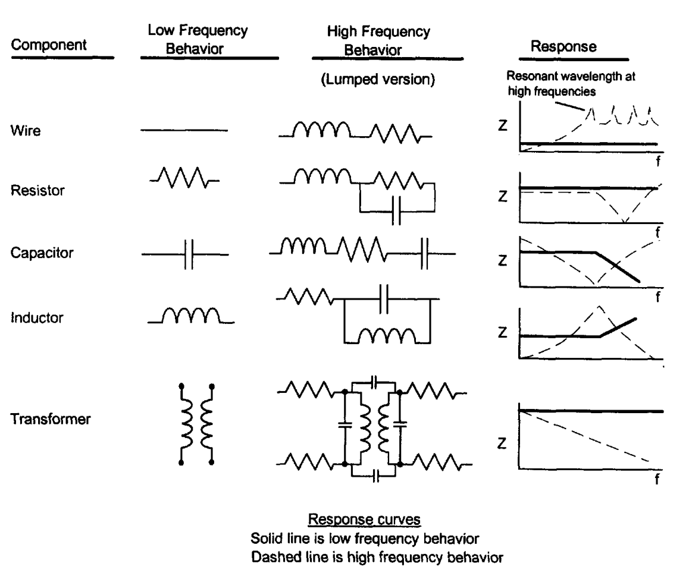

> "Reviewers ridiculed it and consumers spurned it. Nevertheless, as is often with Microsoft products, persistence eventually made Windows better and dominant."
# PCB Technique
Discussion about the PCB design and EMC (Electro-Magnetic Compatibility) never stopped. The thing we need to do seems quite simple, find the three elements of the interference: Source, Propagation path, and Load. And then break them down. Though, the principles are important. You don't want to create a monster with some rigid rules. "The devil is in the detail."

Here, this blog would record some essential information to illustrate the nature of a good design of PCB. Besides, some resources from *Youtube* or some forums may help. 

Meanwhile, since the blogger majored in Power Eletronics, this blog might have a closer relationship to it than the others. Surely, we would also try our best to explain the high-frequency electronics well.

## Overview
In this section, we would give an overview of respectively EMC, PCB and the bond between. 

### Electromagnetic Compatibility (EMC)
- When we talk about EMC... 
  - Regulations: not only on **Emissions** but also **Susceptibility (Immunity)**
  - RFI (Radio Frequency Interference)
  - ESD (ElectroStatic Discharge) *Under the immunity requirement.*
  - Power Disturbances. Analog and digital devices respond differently. Digital circuits are affected by spikes on the power system (EFT and lightning), as well as failure due to excessively high or low voltage levels. Analog devices generally operate on voltage levels, which may be degraded by a disturbance changing the reference level of the system's power source.
  - Self-Compatibility.   
- Element - Propagation Path
  - Direct radiation from source to receptor
  - Direct RF energy radiated from the source transferred to AC mains cables or signal/control cables of the receptor
  - RF energy radiated by AC mains, signal, or control cables from source to receptor
  - RF energy conducted by common electrical power supply lines or by common signal/control cables 
- Coupling Mechanism (for each propagation path)
  - Conductive (Low-Frequency More likely)
  - Electromagnetic (High-Frequency more likely)
- When we talk about interference
  - Frequency. Frequency domain <-> time domain. 
  - Amplitude.
  - Time. Periodic, or only certainly cycles?
  - Impedance. Source, receptor, and transmission. 
  - Dimensions. 
- Causes of system-level EMI
  - Improper use of containment measures. (Metal vs. plastic)
  - Poor design, implementation and grounding of cables or connectors.
  - Incorrect PCB layout. 
    - clocks and periodic signal trace routing
    - stackup arrangement of the PCB and signal routing layer allocation
    - selection of components with high spectral RF energy distribution
    - common-mode and differential-mode filtering
    - ground loops
    - insufficient bypassing and decoupling

### Printed Circuit Board
- Structure of the board
- available development softwares
- process of production

### EMC inside PCB
> EMI is often the result of **exceptions** to the normal rules of passive component behavior. "When is a capacitor not a capacitor?"
  

## Special Topics
- Cross talk
- Impedance and signal reflection

## References
[1] Montrose, M.I., 2004. EMC and the printed circuit board: design, theory, and layout made simple (Vol. 6). John Wiley & Sons. 
[2] H. W. Ott, ‘Electromagnetic Compatibility Engineering’, p. 871.

# GaN HEMT Soft Switching and Hard Switching
> When talking about ~MHz applications of GaN, we are always using soft-switching techniques.  

> Is this true? Why is that? What happens if we want to use hard-switching in MHz occasion?

We will start from the technical support of GaN Systems Inc.

## GaN Systems Inc. Official Application Notes
- Zero reverse recovery of GaN HEMT leads to lower switching loss and less EMI noise. (page 9 in GN001)
- Smaller output capacitance results in lower switching loss and easier ZVS. 
> They assume us adopting or wanting to adopt ZVS. 
-  

## Other options

### monolithic integration
> and not a multi-chip combination of a silicon driver and a gallium nitride power device.  

Navitas Inc.

> This idea is super cool. It's a pity that Navitas doesn't have a 100-V product line, otherwise I would really want to give it a try. 

## References
[1] [application notes of GaN Systems Inc.](https://gansystems.com/design-center/application-notes/)
[2] [Breaking Speed Limits with GaN Power ICs](https://navitassemi.com/breaking-speed-limits-with-gan-power-ics/)

# GaN HEMT Driver Design Comparison
## ACPL-P346-000E
> 2.5-Amp Output Current Power, GaN and SiC MOSFET Gate Drive Optocoupler with Rail-to-Rail Output  

> Rail-to-rail” implies that the signal swings all the way to supply voltage levels on both the positive and negative rails. 
> In this case, it means the on-voltage is VCC and off-voltage is VEE.

### Specifications
- Propagation Delay Time to High Output Level Typ. 55 ns 
- Propagation Delay Time to Low Output Level Typ. 55 ns 
- Pulse width distortion Max. 50 ns 
- Propagation Delay Difference between any two pairs -50 ~ 50 ns 
> Should we set up a deadtime at least 50 ns to avoid this difference?  

- Rise Time Typ. 8 ns (Max. 30 ns)
- Fall Time Typ. 8 ns (Max. 30 ns)

## SI8274
 
### Specifications
- propagation delay time 30 - 45 ns 
- Pulse width distortion (SI8274 with low jitter) 14-19 ns 
- Programmed dead time 20 ns
- Rise time 10.5 ns 
- Fall time 13.3 ns 

## Comparison
- Those two drivers all mentioned that they are ideal for GaN. So pick any of them would work for normal GaN operation. 
- ACPL-P346-000E has a slightly better rising/falling time performance. However, Si8274 has a more accurate and steady dynamic. (The ranges are s are narrow.)
- Surprisingly, they all have a significant propagation delay (or it is common in power semiconductor drivers.) We might be able to ignore this phenomenon at low frequency, however, it would become a pain in the ass when we pushing the frequency high. 

