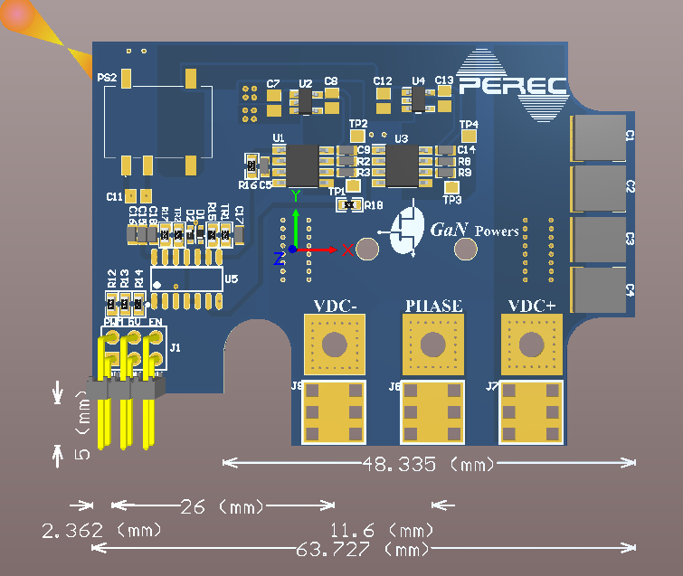
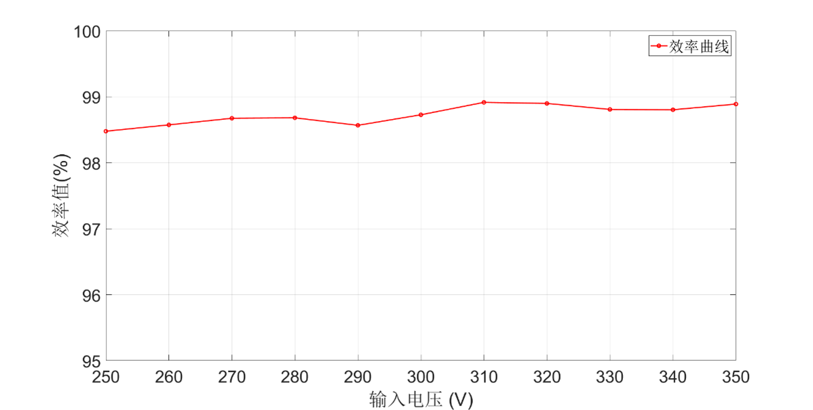
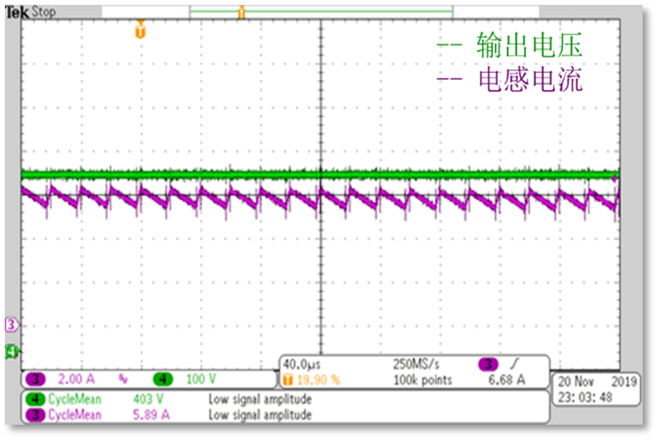
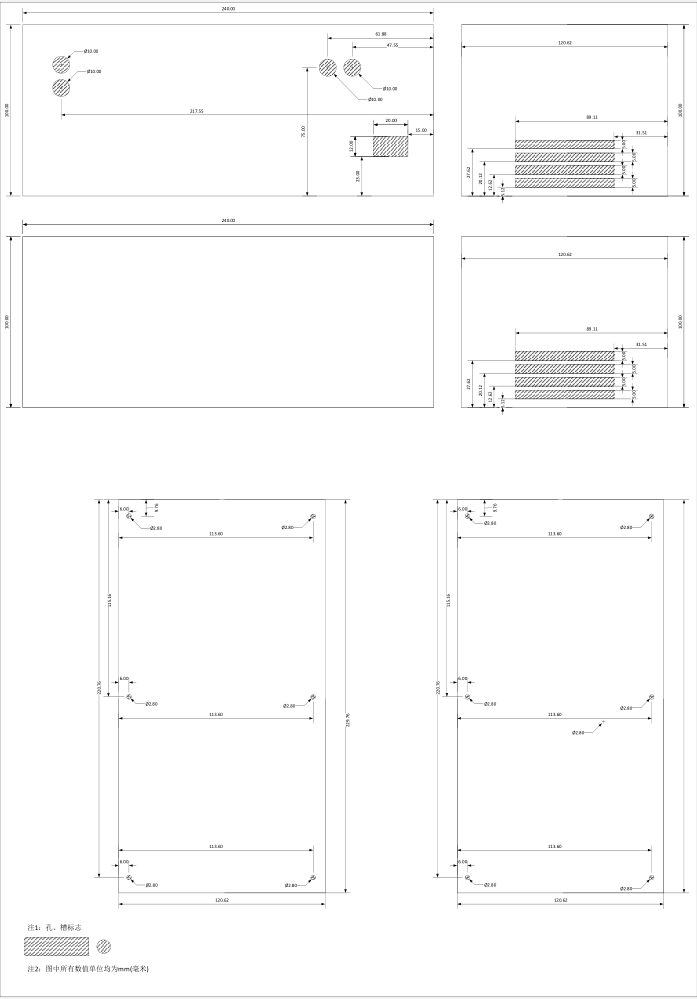

# Background
To power the computer room, we were asked to design a 2kW boost converter prototype. The table below specifies the parameters.

| Parameter | Value |
| -- | -- |
| Input Voltage | 200~350V |
| Output Voltage | 400V |
| Output Ripple | 2% | 
| Power Rating | 2kW |
| Other requirement | Full-GaN |

At this time, [our company](https://shop34012880.taobao.com/?spm=a230r.7195193.1997079397.2.36a35baao0FdHc) (I am the manager, nominated by my senior) was planning for a novel plug-in GaN daughter board. So, "Let's do it."

We developed a daughter board that integrated the power semiconductors and driving circuits. And this project was the first try. 

# Daughter Board
The daughter board consists of two parts, the driving board, which transform the digital pulses into the driving signals for GaN HEMTs, and the power board, which is actually a half-bridge topology and receives the driving signals to commutes the HEMTs. 

The figure below gives information of the **power board**.
  

The figure below gives information of the **driving board**.

Ultimately, we plug the power board onto the driving board, the integrated daughter board forms, as follows.

# Converter
We equiped a mother board for the packaged daughter board. And the ultimate solution is shown in photos below.

The controller realises the functions including dual-loop feedback regulation, over-current protection, soft start, etc.  

# Testing Results
The test is performed with **YOKOGAWA·WT1804E precision power analyzer**.
## Efficiency

The efficiency stays over 98.48% in full voltage range. 
## Adjustment due to Load

Varying with the load, the output voltage changes within 396~401V. 
## Waveforms

The waveforms are given as below. (purple-current; green-voltage)

# Other
I am proud of myself, not because of the converter, but because of the box I made for it, so amateurly professional.

