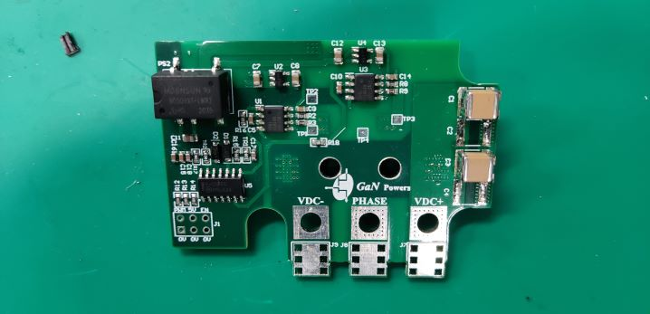

# Background
To supply power for computer room, we were asked to design a 2kW boost converter prototype. The application of GaN HEMT was required. 
Firstly, we developed a daughter board that integrated the power semiconductors and driving circuits. 

# Daughter Board
It consists of a power board, as below,
  
as well as a driving board, as bleow. 

The photo of the daughter board is given as below. 

# Converter
We equiped a mother board for the packaged daughter board. And the ultimate solution is shown in photos below.

