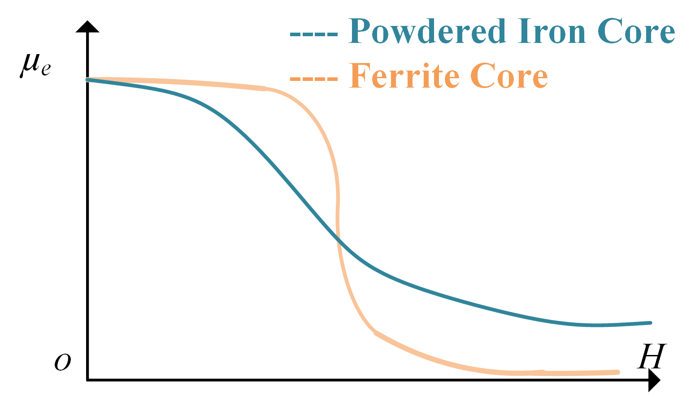
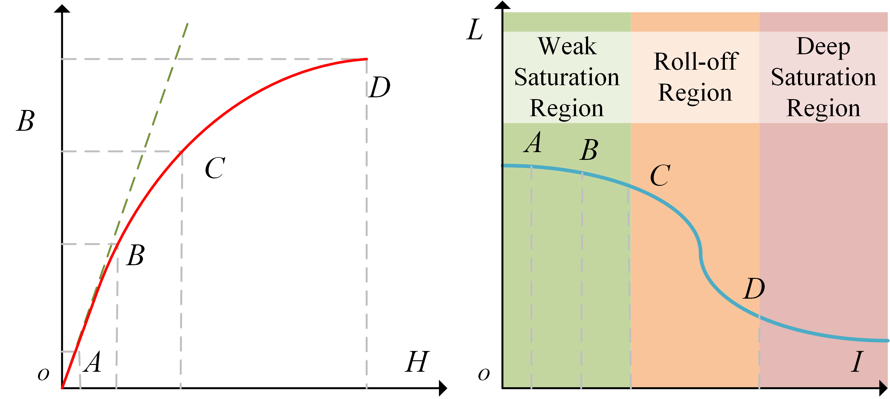
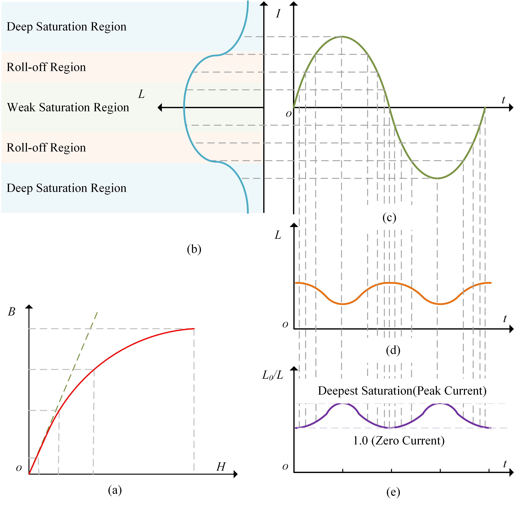
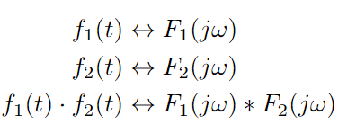
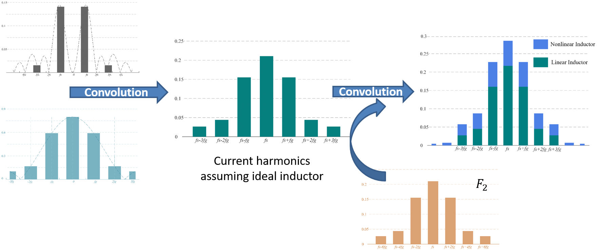
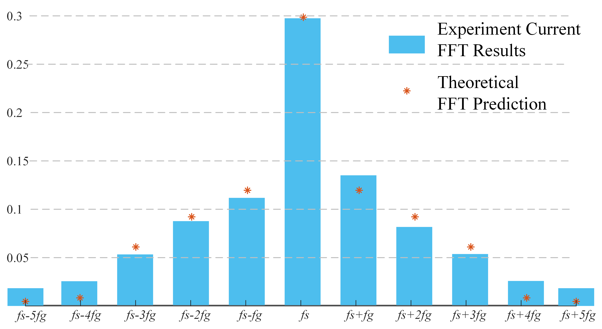
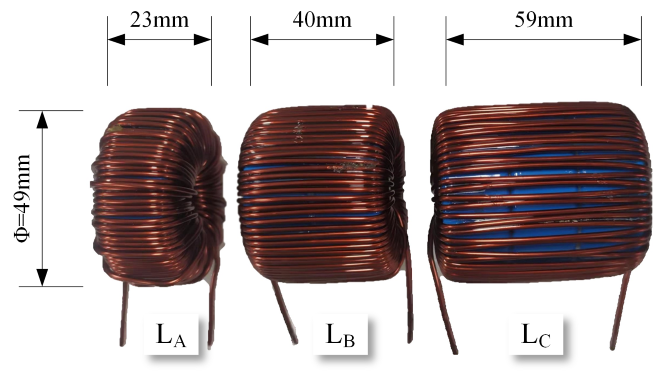

> Actually, this research happened during the development of Totem-Pole PFC converter. However, I found that this idea could be applied to any circuit, and it would be especially useful for those with powdered iron cores. Therefore, I decided it an independent project.

# Background
As the electrical vehicle (EV) being increasingly popular, onboard chargers (OBC) have aroused great research and commercial interest worldwide. The state-of-the-art OBCs usually use Wide-Bandgap devices -- mainly GaN HEMTs and SiC MOSFETs -- because of their low loss and high switching frequency. 
This significantly shrinks the space occupied by heat sink. Meanwhile, the passive components account for the predominant volume of the converter.

# Saturation Influencing Harmonics

Different from traditionally popular ferrite cores, powdered iron cores (PIC) have a special saturation process. 

Saturating earlier but more gentle, the PIC inductance starts to drop even when the current is small while still act functional when it's large. On the contrast, ferrite inductance stays almost constant for a certain range of current, but it suffers a sudden change at the boundary and thus cases unbearable current ripple. 
To avoid the saturation of inductors, we just need to leave a sufficient margin for ferrite cores. However, it is inevitable for PIC inductor to suffer from saturation. Though, the degree varies with the current. 

The saturation plays a role in the whole period. 

To analyze the influence on current harmonics, we adopted the Amplitude Modulation Property of signals, stated as 

Consequently, we decomposed the current ripple into three different signals.

| symbol | Definition |
| --- | --- |
| I_o(t)    |  Fundamental triangle wave at switching frequency | 
| F_1    | Steady-state fluctuation with grid phase and duty cycle |
| F_2    | Effect of inductance drop due to magnetic saturation on the ripple peak-to-peak value |

After this operation, we can predict the harmonics distribution. 

The Totem-Pole pfc rectifier provided a platform to verify this analysis. The comparison below show that the prediction of current harmonics is accurate. 

Certainly, the research should lead to somewhere we can make benefit from it. Therefore, we proposed a variable switching frequency scheme to eliminate the harmonics growth due to the magnetic saturation. 
# Variable Switching Frequency Scheme
To show how effective this scheme is, we made three different inductors with cores of the same material but different quantities -- respectively one, two and three. 

With the proposed variable switching frequency, we can lower the harmonics of the smallest inductor to that of the biggest one. 
