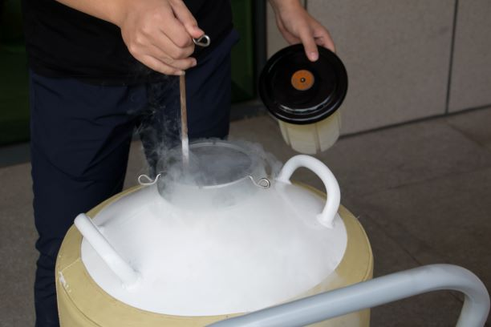
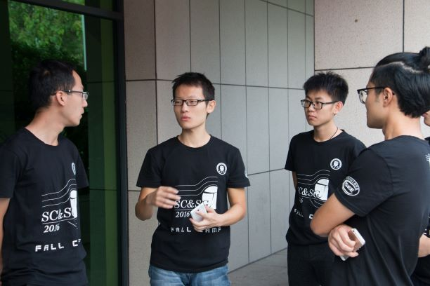
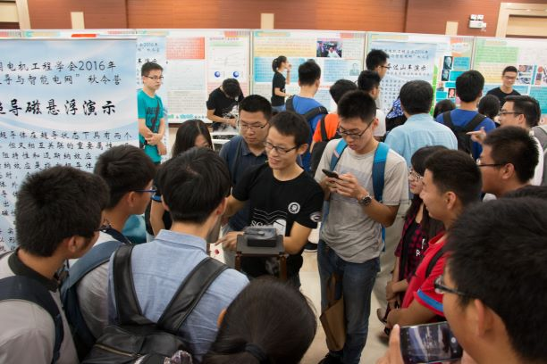

> Thanks for the guidance from Pro. Xin Ying and support from Chinese Society for Electrical Engineering. 
# Background
We organized an visiting activity for all students who registered for the camp. During this visit, we arranged several equipment based on superconducting technology. 
# Equipment Display
## Magnet suspension 

## Obervation of Meissner Effect through Measuring the Force

## Mobius strip

## Roller Coaster

## Maglev vehicle

# Easter egg
## Liquid Nitrogen

We really had great fun of those liquids. It's amazing taht you will be fine if you pour it on your hand......

## Having a discussion

## Presenting an Introduction
 

