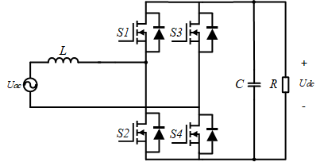
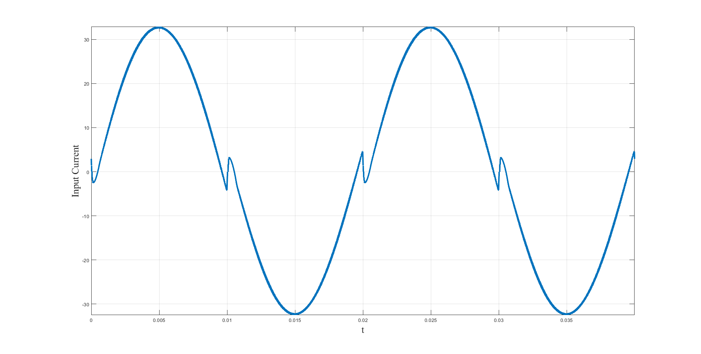

# Background
  Popular electrical appliances need rectifiers to transfer ac power to dc. The market has gradually eliminated traditional diode full-bridge recitifier due to its high current harmonics and low power factor. By contrast, the Totem-Pole bridgeless rectifier arouses wide concerns. The low device cost promises this converter a bright prospect.
# Challenges
   When working in Continuous Conduction Mode (CCM), the Totem-Pole rectifier suffers the current distortion at the zero-crossing area. 
   Traditional dual-loop control tries to make a tradeoff between the grid-frequency reference tracking effect and disturbance suppression. In this way, we might be able to reduce the zero-crossing distortion but likely to introduce high-frequency harmonics. 
## Waveforms Description
   
  
  
  
# Methodology

# Experiments
  Results
  
# Small Tricks
  Simulation

What have we done.

What results have been obtained.

What we will do in the future.
