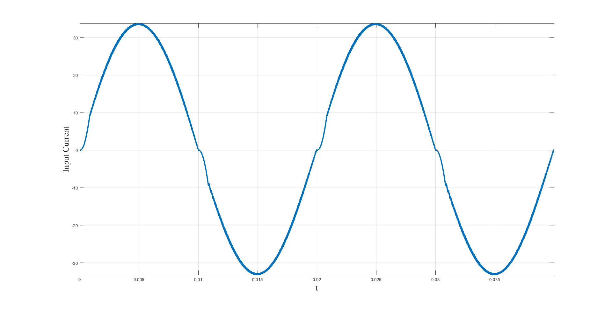

# Background
  Popular electrical appliances need rectifiers to transfer ac power to dc. The market has gradually eliminated traditional diode full-bridge recitifier due to its high current harmonics and low power factor. By contrast, the Totem-Pole bridgeless rectifier arouses wide concerns. The low device cost promises this converter a bright prospect.
# Challenges
We overcame many difficulties to obtain the ultimate solution -- 98.1% peak efficiency and unity power factor.
## Current Zero-Crossing Distortion
When working in Continuous Conduction Mode (CCM), the Totem-Pole rectifier suffers the current distortion at the zero-crossing area. 
  
Traditional dual-loop control tries to make a tradeoff between the grid-frequency reference tracking effect and disturbance suppression. In this way, we might be able to reduce the zero-crossing distortion but likely to introduce high-frequency harmonics. 
  
The figure below illustrates cause for this phenomenon.

Totem-Pole converter is actually alternating between two Boost circuits with different input polarity but the same output polarity. The control structure is the same while the initial states are different of those two modes. It takes the controller considerable periods to finish the switch during the zero-crossing. Thus, distortion happens. 
Based on this analysis, we proposed a non-linear control scheme to solve this paradox, Precise Correction. 
 
The controller extract the current information in the zero-crossing vicinity. Outside the original current control loop, we added an extra loop to compensate the distortion in the last period, and ultimately eliminated the distortion with introducing any high-frequency interference. 

Finally, we saved the Totem-Pole rectifier from the zero-crossing distortion and endowed it with a unity power factor.

## Application of Wide-Bandgap Devices
Wide-Bandgap devices -- SiC MOSFET and GaN HEMT are the most popular nowadays -- have shown great potential in all sorts of applicances. Though, related challenges have impeded our development more than once.

The initial design is based on the SiC MOSFETs, *C3m0075120k* from *Wolf Speed Co*. Surprisingly, the process went really well. It took me three months to build this prototype. 

This prototype integrated the controller *TMS320FS28377-D*, the sampling circuit, and all other necessary parts. The overall efficiency attained 98.1%; the power factor reached 100%.  

# Plan

What have we done.

What results have been obtained.

What we will do in the future.
