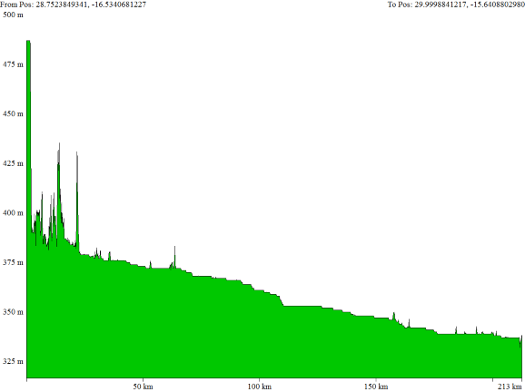
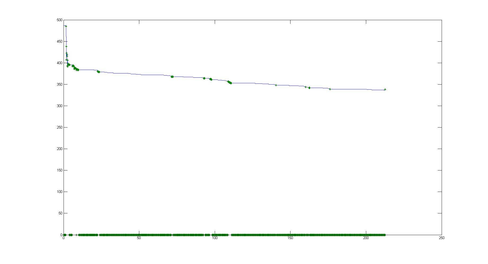
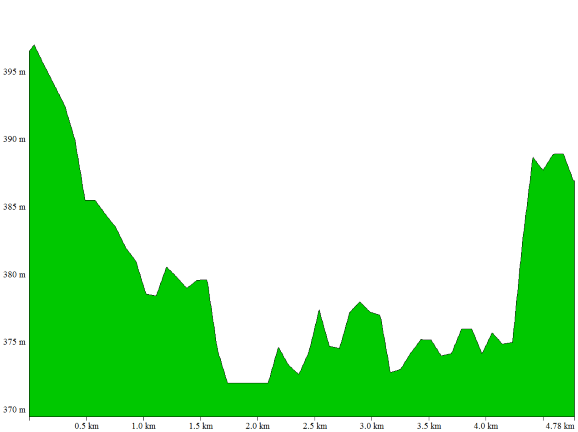
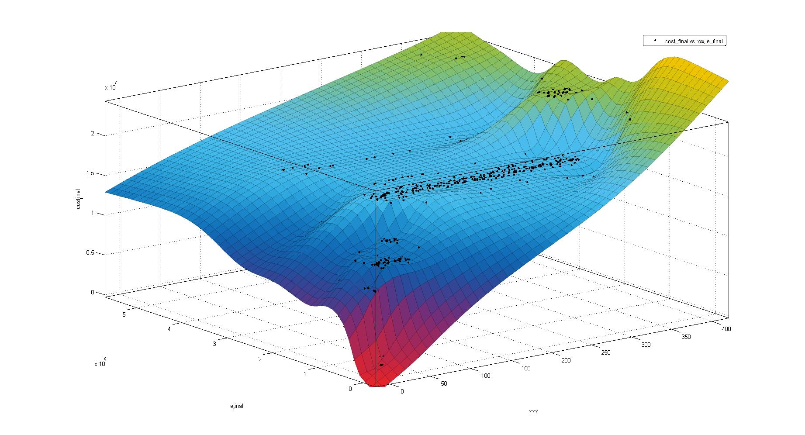
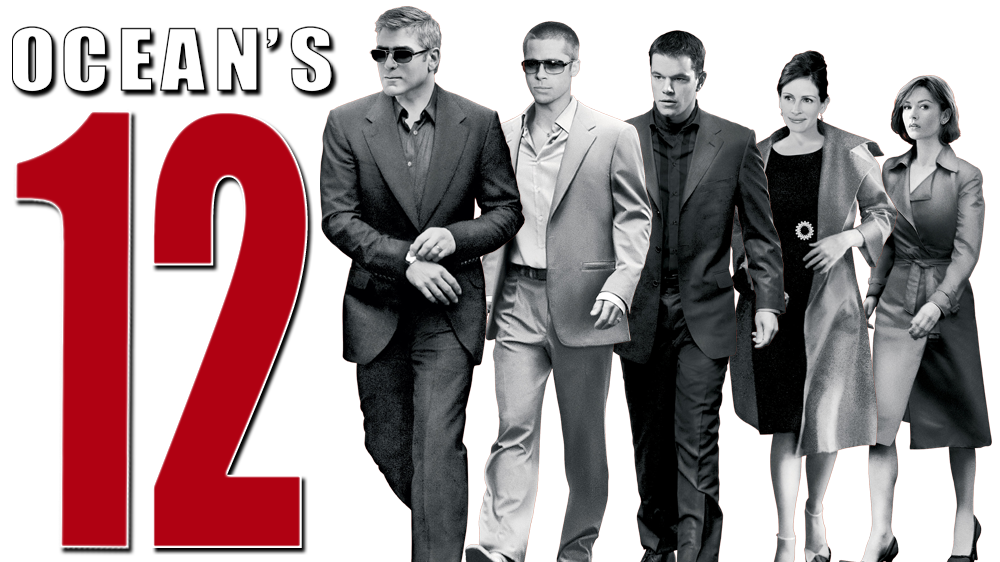

# Background
> The Kariba Dam on the Zambezi River is one of the larger dams in Africa. Its construction was controversial, and a 2015 report by the Institute of Risk Management
of South Africa included a warning that the dam is in dire need of maintenance. A number of options are available to the Zambezi River Authority (ZRA) that might address the situation. Three options in particular are of interest to ZRA:
> * (Option 1) Repairing the existing Kariba Dam,
> * (Option 2) Rebuilding the existing Kariba Dam, or
> * (Option 3) Removing the Kariba Dam and replacing it with a series of ten to twenty smaller dams along the Zambezi River.

# Methodology

## Collecting Geographic Information
We used Google Map to obtain the waterfall and river topography. 

Then we abstracted the altitude of the river and bank. 

## Selecting Sites
Pick the best 100 sites of the dams. 

## Deciding the final quantity of dams
We took three factors into consideration to adjust the final number of the dams. 
1. The status of the last dam
2. The critical terrain
3. The utilization of hydropower

# Final 
The analysis led to the final scheme of twelve dams. Also, we gave a detailed operation strategy according to local seasonal rainfall; the main algorithm used here is the Zero-One programming.
> During this contest, we really exhausted ourselves. I can't remember how many cups of coffee I drank exactly, but I did manage to make two hours for myself to watch a movie, the Ocean's Twelve. And that --- my friend --- is why I named our final manuscript *Kariba's Twelve*.

